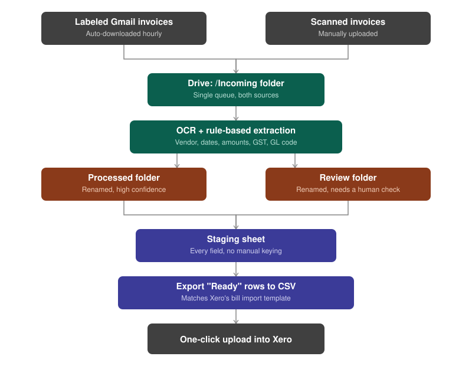

# Payables Automation — Google Drive + Apps Script

A low-code accounts payable automation built entirely on free-tier
Google tools: Gmail, Drive, Sheets, and Apps Script. No paid API keys,
no ERP integration required.

It replaces a manual process — download invoices from email one at a
time, open each one to read the details, rename the file, key
everything into the accounting system by hand — with a pipeline that
runs itself hourly and only asks a human to look at what it can't
confidently read.



## What it solves

| Manual process | This automation |
|---|---|
| Invoices downloaded one email at a time; some get missed | A labeled Gmail sweep grabs every attachment on a schedule |
| Every invoice opened by hand to read vendor, date, amount, GST | Drive's built-in OCR + rule-based parsing extracts it automatically |
| Files renamed and re-keyed into the accounting system one by one | Files auto-rename, data lands in a staging sheet, and a one-click export produces a Xero-ready bulk import CSV |

## Proof it works, not just a demo

A 12-invoice test set (included in `sample-data/test-invoices/`) was
built to deliberately break the system, not just run it: 9 clean
invoices, and 3 with a specific, different failure mode each (unknown
vendor, missing invoice number, unreadable amounts). All 9 landed as
"Ready." All 3 were correctly routed for human review instead of
silently entering wrong data. See [`docs/TESTING.md`](docs/TESTING.md)
for the full expected-results table.

## Repo layout

```
src/            The 6 Apps Script files — copy these into your project
docs/           Setup guide, testing guide, and the debugging log
sample-data/    12 test invoices + seed data for the vendor lookup tab
```

## Get started

1. [`docs/SETUP.md`](docs/SETUP.md) — create the Drive folders, the
   control sheet, and install the script (~20 min, one-time)
2. [`docs/TESTING.md`](docs/TESTING.md) — verify it with the included
   sample invoices before pointing it at real ones

## Worth reading: what actually broke

This was built and tested iteratively, not written once and left
alone. [`docs/DEBUGGING_LOG.md`](docs/DEBUGGING_LOG.md) walks through
four real bugs found during testing — a platform API deprecation, a
regex false-positive, a data-leakage bug, and a date-locale bug — each
with the actual before/after code and why it broke.

## Known limitations / roadmap

- **Date parsing assumes day-first (DD/MM/YYYY)** for every vendor. A
  vendor using US-style MM/DD/YYYY would currently be misread. Planned
  fix: a per-vendor date-format column in the `VendorMap` tab.
- No duplicate-invoice detection yet (same vendor + invoice number
  processed twice).
- Rule-based OCR parsing is good, not perfect, on unusual layouts —
  by design, anything incomplete is routed to `/Review` rather than
  guessed. A natural v2 upgrade is swapping the extraction step for a
  Gemini API call while keeping the same staging/export architecture.
- Xero CSV import lands bills as **Draft** — someone still approves
  the batch in Xero, which is an intentional safety net, not a gap.

## License

MIT — see [`LICENSE`](LICENSE). All sample invoices and vendor data
are fictional, generated for testing.
